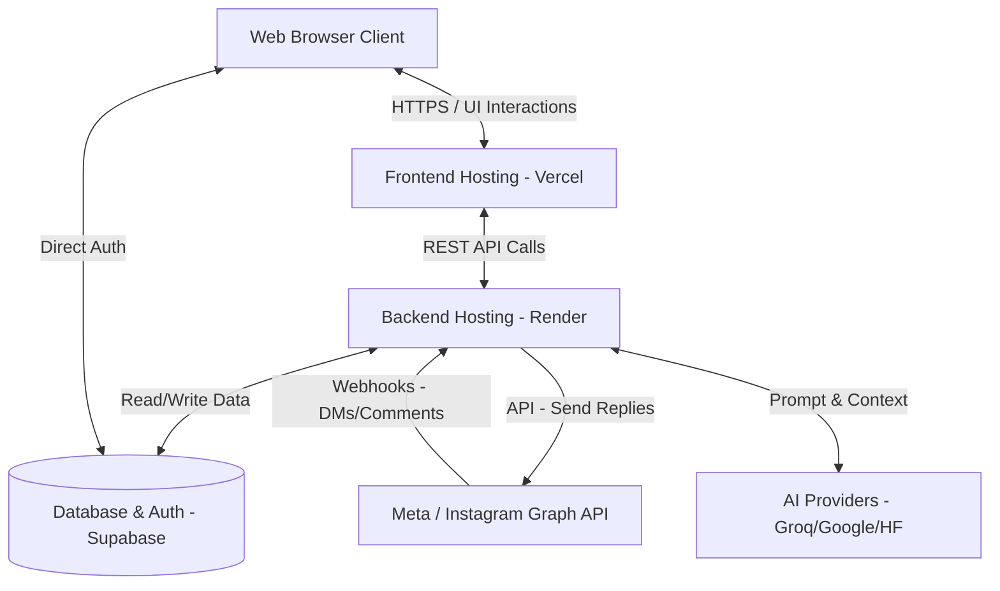

# ReplyLink - System Design Document

This document provides a comprehensive overview of the **ReplyLink** architecture, tech stack, and data flows. It is designed to give you a clear understanding of the system's design for your interview preparation.

## 1. System Overview

**ReplyLink** is a SaaS platform designed to automate Instagram interactions. It allows businesses and creators to connect their professional Instagram accounts and set up AI-driven or keyword-based automated replies to Direct Messages (DMs) and comments. 

The core value proposition is saving time and converting leads by instantly engaging with users on Instagram through official Meta APIs.

## 2. High-Level Architecture

The system follows a modern decoupled architecture, split between a client-side frontend, a server-side API, and a managed database/authentication provider.

## 3. Technology Stack

### Frontend (User Interface)
*   **Framework:** Next.js 16 (App Router)
*   **Library:** React 19
*   **Styling:** Tailwind CSS 4, Shadcn UI, Lucide React (Icons)
*   **State Management / Data Fetching:** TanStack React Query (`@tanstack/react-query`)
*   **Form Handling & Validation:** React Hook Form + Zod
*   **Hosting:** Vercel

### Backend (API & Webhook Processing)
*   **Framework:** FastAPI (Python 3) with Uvicorn
*   **AI Integrations:** Groq, Google GenAI, HuggingFace (`transformers`)
*   **Data Processing:** NumPy, SciPy, Scikit-learn
*   **Authentication & Tokens:** PyJWT, bcrypt, passlib
*   **Hosting:** Render

### Database & Authentication
*   **Provider:** Supabase
*   **Database:** PostgreSQL (Relational Data)
*   **Authentication:** Supabase Auth (JWT based, Handles User Sessions)
*   **Client Libraries:** `@supabase/ssr` (Frontend), `supabase-py` (Backend)

## 4. Core Components & Responsibilities

### 4.1. The Next.js Frontend
*   **Dashboard & Configuration:** Provides the UI for users to manage their connected accounts, set up keyword automations, configure AI agents, and view analytics/tracking.
*   **Client-side Routing:** Fast transitions between dashboard pages (Automations, Inbox, Settings).
*   **Direct DB/Auth Connection:** Uses Supabase SSR to handle user sessions and can directly read certain public/user-scoped data via Row Level Security (RLS) policies.

### 4.2. The FastAPI Backend
*   **Webhook Receiver (`/webhook`):** The most critical component. It listens for incoming HTTP POST requests from Meta when an Instagram user messages a connected account.
*   **Business Logic Layer:** 
    *   **Automations (`app.api.automations`):** Evaluates incoming messages against user-defined keywords (e.g., if message contains "PRICE", send Pricing link).
    *   **AI Agents (`app.api.ai_agents`):** For complex queries, it routes the message context to an LLM (Groq/Google GenAI) along with the user's Knowledge Base to generate a contextual reply.
*   **Meta API Integrations:** Handles the OAuth flow (`/api/auth/meta/intent`) to connect accounts and manages Meta Page Access Tokens.

### 4.3. Database Schema (Supabase PostgreSQL)
*   **Users:** Authenticated platform users.
*   **Connected Accounts:** Stores Instagram Account IDs, Facebook Page IDs, and long-lived OAuth access tokens securely.
*   **Automations / Rules:** Stores keyword triggers and predefined response templates.
*   **Knowledge Base:** Stores business data (documents, FAQs) used for RAG (Retrieval-Augmented Generation) by the AI agents.
*   **Contacts & Tracking:** Logs incoming messages, lead data, and automation performance metrics (Messages Sent, Link Clicks).

## 5. Key Data Flows

### 5.1. User Onboarding & Meta Authentication
1. User logs into ReplyLink via Supabase Auth.
2. User clicks "Connect Instagram" on the Dashboard.
3. Frontend redirects to the Backend's Meta Auth endpoint (`/api/auth/meta/login`).
4. User logs into Facebook/Instagram and grants permissions (Read & Reply).
5. Meta redirects back to Backend with a short-lived auth code.
6. Backend exchanges the code for a long-lived Page Access Token.
7. Backend subscribes the user's Facebook Page to the ReplyLink Webhook.
8. Account details and tokens are securely saved in Supabase.

### 5.2. Webhook Processing (Handling an incoming DM)
1. **Trigger:** An Instagram user sends a DM to a ReplyLink-connected business account.
2. **Event:** Meta sends an event payload to `POST /webhook` on the FastAPI backend.
3. **Parse & Authenticate:** The `webhook_handler` parses the JSON, verifies the sender, and looks up the business's configurations in Supabase using the recipient Instagram ID.
4. **Decision Engine:**
   *   *Keyword Match:* Checks if the message text matches any predefined keywords in the `automations` table.
   *   *AI Agent:* If enabled and no keyword matches, it fetches the business's Knowledge Base, constructs a prompt, and queries the LLM (e.g., Groq) for a response.
5. **Execution:** The Backend uses the saved Meta Access Token to make an HTTP POST request to the Meta Graph API, sending the reply text back to the Instagram user.
6. **Logging:** The interaction is logged in the `tracking` and `contacts` tables for analytics.

## 6. Interview Talking Points

If asked about the system design, highlight these architectural decisions:

*   **Why FastAPI for the backend?** Webhook processing requires high concurrency. FastAPI is asynchronous by default, making it incredibly fast and efficient at handling thousands of simultaneous incoming webhooks from Meta without blocking threads.
*   **Why Supabase?** It accelerates development by providing a managed PostgreSQL instance alongside robust Authentication and Row Level Security (RLS). This means the frontend can securely fetch its own data directly if needed, reducing backend boilerplate.
*   **Scalability of Webhooks:** As the app grows, the `/webhook` endpoint could become a bottleneck. *Future optimization:* Introduce a message queue (like Redis/Celery or RabbitMQ). The webhook endpoint immediately returns a `200 OK` to Meta and pushes the payload to the queue, while background workers process the logic and send replies asynchronously.
*   **AI Integration Strategy:** The system is designed to be model-agnostic, leveraging `groq` and `google-genai`. This allows falling back to different models or optimizing for latency (e.g., Groq for extremely fast text generation) versus reasoning capabilities.
